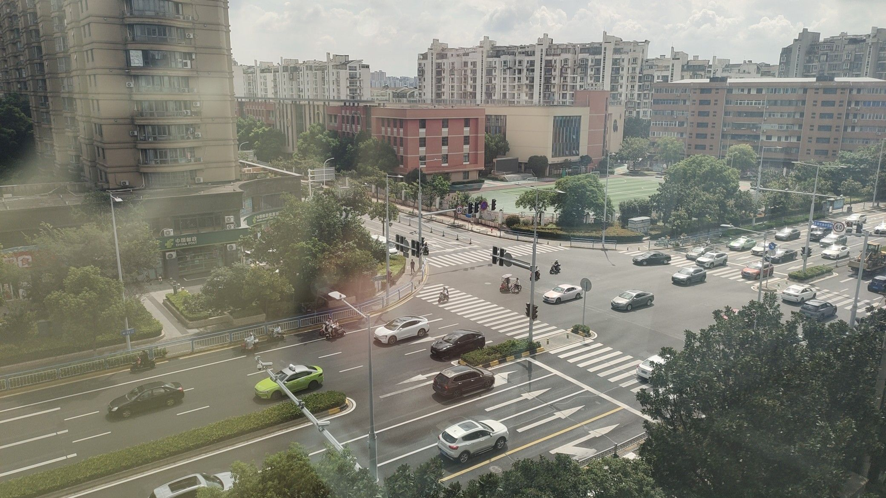

# changzhou_research

# 徒步轨迹交互式地图

一个基于 **Python + Folium + Leaflet.js** 生成的本地交互式徒步轨迹故事地图（Interactive Story Map）。

该项目读取两步路（或其他支持 KML/KMZ 导出的轨迹数据）中的 **KML 路线文件**，结合照片的 **EXIF GPS 信息**，生成一个包含路线、照片位置、分段浏览和自动播放功能的交互式 HTML 地图。

生成后的 HTML 可以直接在浏览器中打开，无需运行 Python 服务器。

---

## 1. 项目功能

生成的 `index.html` 主要提供以下功能：

### 1.1 徒步路线可视化

* 在地图上显示完整徒步路线
* 使用 CARTO Positron 作为底图
* 路线以灰色线条显示
* 地图支持缩放、拖动等 Leaflet 基础交互

### 1.2 照片位置标记

每一张具有 GPS 信息的照片都会在地图上对应一个照片点。

普通照片点：

* 小型圆形标记
* 点击后可以查看对应照片

### 1.3 当前照片高亮

当右侧播放面板显示某一张照片时：

* 地图上对应位置会显示特殊高亮点
* 高亮点带有脉冲动画
* 高亮点显示当前照片编号，例如 `#55`
* 切换上一张 / 下一张照片时，高亮点同步移动
* 播放过程中高亮点会随着照片自动更新

因此可以形成：

```text
右侧当前照片
      ↓
照片 GPS / 路线对应位置
      ↓
地图当前高亮点
```

实现照片与空间位置之间的动态对应。

### 1.4 地图点击 → 照片跳转

可以直接点击地图上的照片点。

例如点击：

```text
照片 #73
```

右侧会自动：

* 切换到照片 #73
* 自动切换到照片所在路线段
* 更新右侧主照片
* 更新播放进度
* 更新底部照片缩略图
* 更新地图当前高亮点
* 地图移动到对应照片位置
* 自动停止当前播放

### 1.5 路线分段浏览

目前路线被划分为 8 个 segment：

| Segment | 路线            | 照片                 |
| ------- | ------------- | ------------------ |
| 1       | 晋绫北路          | 1–13、26–46、170–174 |
| 2       | 北塘河（南）        | 14–25              |
| 3       | 庐山路（新北中心公园）   | 47–54              |
| 4       | 珠江路           | 55–92              |
| 5       | 龙业路（恐龙园）      | 93–101             |
| 6       | 河海东路          | 102–109            |
| 7       | 龙沧路           | 110–127            |
| 8       | 北塘河（北）&创意产业园区 | 128–168            |

其中：

**晋绫北路是一个连续的播放段，但照片编号是不连续的：**

```text
1–13
26–46
170–174
```

切换到该 segment 后，会按照上述顺序播放。

### 1.6 自动播放

右侧播放面板支持：

* 上一张
* 播放 / 暂停
* 下一张
* 自动播放
* 当前进度显示
* 进度条
* 底部照片缩略图

默认每张照片播放：

```text
3500 ms = 3.5 秒
```

播放到当前 segment 最后一张照片后自动停止。

### 1.7 底部 Filmstrip

右侧底部显示当前路线段的全部照片缩略图。

点击任意缩略图可以直接跳转到对应照片。

---

# 2. 项目文件结构

推荐使用以下目录结构：

```text
路线/
│
├── README.md
├── generate_story_map.py
├── index.html
│
├── *.kml
│
└── files/
    ├── 1.jpg
    ├── 2.jpg
    ├── 3.jpg
    ├── ...
    └── 174.jpg
```

其中：

### `generate_story_map.py`

Python 生成脚本。

负责：

* 读取 KML
* 提取路线
* 读取照片
* 提取照片 EXIF GPS
* 建立照片与路线位置的对应关系
* 生成 Folium 地图
* 生成最终 `index.html`

### `*.kml`

徒步轨迹文件。

脚本会自动寻找：

```text
路线/*.kml
```

并默认使用找到的第一个 KML 文件。

### `files/`

照片文件夹。

脚本会递归读取：

```text
路线/files/
```

下面的：

```text
.jpg
.jpeg
.png
.webp
```

等图片文件。

### `index.html`

Python 脚本最终生成的交互式网页。

---

# 3. 环境要求

建议使用 Python 3.9+。

需要安装：

```bash
pip install folium pillow
```

如果使用 Anaconda：

```bash
conda install folium pillow
```

---

# 4. 使用方法

## Step 1：准备文件

确保目录结构正确：

```text
路线/
├── generate_story_map.py
├── your_route.kml
└── files/
    ├── 1.jpg
    ├── 2.jpg
    ├── ...
    └── 174.jpg
```

---

## Step 2：配置 CARTO API Key

在 Python 文件中找到：

```python
CARTO_API_KEY = ""
```

填写自己的 CARTO API Key：

```python
CARTO_API_KEY = "YOUR_API_KEY"
```

如果不需要 API Key，也可以保持：

```python
CARTO_API_KEY = ""
```

底图地址由：

```python
BASEMAP_SOURCE = (
    "https://basemaps.cartocdn.com/light_all/{z}/{x}/{y}.png"
    f"?key={CARTO_API_KEY}"
)
```

生成。

---

## Step 3：运行 Python

在 `路线` 文件夹中运行：

```bash
python generate_story_map.py
```

运行成功后会生成：

```text
路线/index.html
```

终端会输出类似：

```text
读取 KML：路线/xxx.kml
路线点数量：xxxx
照片数量：174

============================================================
生成完成！
============================================================
HTML：路线/index.html
照片：174
路线点：xxxx
```

---

# 5. 打开 HTML

生成后可以直接双击：

```text
index.html
```

使用浏览器打开。

推荐：

* Google Chrome
* Microsoft Edge
* Firefox

不需要启动 Flask、FastAPI 或其他 Web Server。

---

# 6. 图片为什么没有嵌入 HTML？

本项目没有使用 Base64 将照片直接写入 HTML。

例如没有采用：

```html

```

而是使用相对路径：

```html

```

因此：

```text
index.html
```

本身只保存：

* 路线数据
* 照片编号
* 照片路径
* GPS 信息
* JavaScript 逻辑
* 页面样式

实际图片仍然保存在：

```text
files/
```

目录中。

这样可以显著降低 HTML 文件大小。

---

# 7. 图片路径机制

Python 会自动计算照片相对于 `路线/` 的路径。

例如：

```text
路线/files/55.jpg
```

会生成：

```text
files/55.jpg
```

因此：

```text
路线/
├── index.html
└── files/
    └── 55.jpg
```

两者的相对关系不能改变。

如果移动 `index.html`，需要同时保持：

```text
files/
```

目录的位置关系。

---

# 8. 照片编号规则

照片编号按照 Python 中的自然排序结果自动生成。

例如：

```text
1.jpg
2.jpg
3.jpg
...
10.jpg
11.jpg
```

会按照：

```text
1
2
3
...
10
11
```

的自然顺序读取。

而不是普通字符串排序产生的：

```text
1
10
11
2
3
...
```

因此照片编号与文件读取顺序保持一致。

---

# 9. EXIF GPS

程序会尝试从照片 EXIF 中读取：

```text
GPSLatitude
GPSLatitudeRef
GPSLongitude
GPSLongitudeRef
```

例如：

```text
Latitude: 31.xxxxx
Longitude: 119.xxxxx
```

如果照片具有 GPS 信息：

* 地图上生成照片点
* 可以点击照片点
* 播放时可以高亮照片位置
* 地图可以自动移动到照片位置

如果照片没有 GPS：

* 右侧仍然可以显示照片
* 但该照片不会拥有地图位置
* 播放时不会移动地图

---

# 10. 照片与路线的空间对应

照片 GPS 和 KML 路线坐标并不一定完全重合。

因此程序会计算：

```text
照片 GPS
   ↓
寻找最近的路线坐标点
   ↓
trackLat / trackLon
```

这两个字段用于当前照片地图高亮。

照片数据在 HTML 中类似：

```javascript
{
    "number": 55,
    "src": "files/55.jpg",
    "lat": 31.xxxxx,
    "lon": 119.xxxxx,
    "trackLat": 31.xxxxx,
    "trackLon": 119.xxxxx
}
```

其中：

* `lat / lon`：照片 EXIF GPS
* `trackLat / trackLon`：路线上的最近点

因此当前高亮点会尽可能贴合实际徒步路线。

---

# 11. 如何修改路线分段

所有路线分段都集中在 Python 文件中的：

```python
SEGMENTS = [
    ...
]
```

例如：

```python
{
    "name": "珠江路",
    "ranges": [(55, 92)]
}
```

表示：

```text
珠江路
照片 55–92
```

如果一个路线段包含多个不连续范围：

```python
{
    "name": "晋绫北路",
    "ranges": [
        (1, 13),
        (26, 46),
        (170, 174)
    ]
}
```

就会按照：

```text
1 → 2 → ... → 13
→ 26 → 27 → ... → 46
→ 170 → ... → 174
```

播放。

---

# 12. 如何修改播放速度

Python 生成的 JavaScript 中有：

```javascript
playTimer = setInterval(
    function() {
        ...
    },
    3500
);
```

这里的：

```text
3500
```

单位是毫秒。

因此：

|   数值 |      播放速度 |
| ---: | --------: |
| 2000 |   2 秒 / 张 |
| 3000 |   3 秒 / 张 |
| 3500 | 3.5 秒 / 张 |
| 5000 |   5 秒 / 张 |

例如改成 5 秒：

```javascript
}, 5000);
```

---

# 13. 如何修改地图 / 右侧面板比例

当前布局为：

```text
地图 60%
右侧 40%
```

对应：

```css
#__MAP_NAME__ {
    width: 60% !important;
}

#story-panel {
    width: 40%;
}
```

如果希望右侧更宽，可以修改为：

```text
地图 55%
右侧 45%
```

对应：

```css
#__MAP_NAME__ {
    width: 55% !important;
}

#story-panel {
    width: 45%;
}
```

如果希望地图更大，则可以改回：

```text
地图 65%
右侧 35%
```

---

# 14. 当前照片地图高亮机制

当前照片使用独立的 Leaflet Marker：

```javascript
currentHighlight
```

它与普通照片点不同。

普通照片点：

```text
小圆点
```

当前照片：

```text
      脉冲圈
        ○
       ●
      #55
```

当照片变化时：

```javascript
moveCurrentHighlight(photo);
```

会更新高亮点位置。

因此在自动播放过程中，地图上的当前照片位置会同步变化。

---

# 15. 地图点击照片机制

地图上的照片点绑定了点击事件。

点击地图上的照片：

```text
地图照片点
      ↓
识别照片编号
      ↓
查找所在 Segment
      ↓
更新 currentSegmentIndex
      ↓
更新 currentPhotoIndex
      ↓
更新右侧照片
      ↓
更新进度条
      ↓
更新 Filmstrip
      ↓
更新地图高亮点
```

因此地图和右侧面板是双向联动的。

---

# 16. 双向交互逻辑

整个系统可以理解为：

```text
                  ┌───────────────┐
                  │   徒步路线 KML │
                  └───────┬───────┘
                          ↓
                    路线坐标数据
                          │
                          ↓
┌──────────────┐    ┌───────────────┐
│   照片 EXIF   │ →  │  照片 + GPS 数据 │
└──────────────┘    └───────┬───────┘
                            ↓
                    ┌───────────────┐
                    │  Interactive  │
                    │   Story Map   │
                    └───────┬───────┘
                            │
             ┌──────────────┴──────────────┐
             ↓                             ↓
       ┌───────────┐                ┌────────────┐
       │    地图    │                │ 右侧照片面板 │
       └─────┬─────┘                └──────┬─────┘
             │                             │
       点击照片点                       播放 / 点击照片
             │                             │
             └──────────→ ←───────────────┘
                    双向联动
```

---

# 17. 常见问题

## 17.1 HTML 打开后没有照片

首先检查：

```text
index.html
files/
```

是否处于同一级目录。

正确：

```text
路线/
├── index.html
└── files/
    ├── 1.jpg
    └── 2.jpg
```

错误：

```text
路线/
├── index.html
└── photos/
    └── files/
        ├── 1.jpg
        └── 2.jpg
```

---

## 17.2 地图没有照片点

可能原因：

照片没有 EXIF GPS。

可以检查照片是否包含：

```text
GPSLatitude
GPSLongitude
```

没有 GPS 的照片仍然可以在右侧播放，但无法显示地图位置。

---

## 17.3 地图点击照片点没有反应

确保使用的是最新生成的：

```text
index.html
```

建议重新运行：

```bash
python generate_story_map.py
```

然后重新打开 HTML。

如果浏览器缓存了旧版本，可以使用：

```text
Ctrl + F5
```

强制刷新。

---

## 17.4 修改 Python 后 HTML 没有变化

Python 文件只是**生成器**。

修改：

```text
generate_story_map.py
```

以后需要重新运行：

```bash
python generate_story_map.py
```

才会重新生成：

```text
index.html
```

---

# 18. 注意事项

### 不要单独移动 `index.html`

`index.html` 依赖：

```text
files/
```

中的照片。

因此建议始终保持：

```text
路线/
├── index.html
└── files/
```

的目录关系。

### 不要删除照片

如果 HTML 中引用：

```text
files/55.jpg
```

但实际文件不存在：

```text
files/55.jpg
```

对应位置将无法显示照片。

### KML 文件

程序默认读取：

```python
list(TRIP_DIR.glob("*.kml"))
```

找到的第一个 KML 文件。

如果 `路线` 文件夹里存在多个 KML，建议只保留需要使用的那个，或者修改：

```python
KML_FILE = ...
```

为指定文件。

---

# 19. 输出结果

最终只需要保留：

```text
路线/
│
├── generate_story_map.py
├── index.html
├── README.md
│
├── your_route.kml
│
└── files/
    ├── 1.jpg
    ├── 2.jpg
    ├── ...
    └── 174.jpg
```

其中：

```text
generate_story_map.py
```

负责生成网页，

```text
index.html
```

是最终可以直接展示的交互式地图，

```text
files/
```

保存原始照片，

```text
README.md
```

用于记录项目结构、运行方法和维护方法。

---

# 20. 项目核心特点

本项目采用：

**KML 路线 + EXIF GPS + Folium/Leaflet + 本地照片资源**

构建轻量级交互式徒步故事地图。

核心特点包括：

* 路线空间可视化
* 照片 GPS 定位
* 路线分段浏览
* 自动照片播放
* 地图与照片双向联动
* 当前照片空间位置高亮
* 地图点 → 照片跳转
* 照片 → 地图位置跳转
* 本地 HTML 离线展示
* 图片不进行 Base64 嵌入
* HTML 文件体积较小
* 不需要部署后端服务

整个项目可以作为一个独立的本地 **Interactive Walking Route Story Map** 使用。
